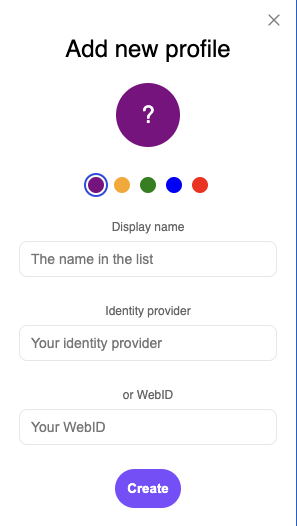

# Solid Identity Manager

This Chrome extension acts as a remote control to manage your Solid identities and
make it easy for users to switch between their WebIDs or IDPs.
The way this works is by giving users the option to add profiles to the extension which
it will store to persist over the course of its use.




The profile has a name and
a color to distinguish it from other profiles.
The extension lists all profiles when clicking on the extension's icon.


The extension provides an API to a Solid app through the use of `chrome.runtime.connect`.
You find an example in `showcase-app/plugin`.
The idea is for the Solid app to manage the authentication itself, and
the extension only provides a way of keeping track of Solid identities.

You find a screencast [here](https://cloud.ilabt.imec.be/index.php/s/9C63HqJmZiJj4e5).

## Quickstart

We developed this extension using Node v18.

```shell
npm i
npm start
```

This will start up the build-process with hot-reload.

To add the extension to the browser, navigate to `chrome://extensions/` and click `Load unpacked`.
Navigate and add the `dist/` folder of this project.

Hot-reloading replenishes the files every time you save something in `src`.
In some cases, mainly when errors occur, you must reload the module in the `chrome://extensions/`.
It should not be removed. You may pin the extension for convenience.

Use the `showcase-app` if you want to try out an example Solid app to test this extension end-to-end.

```shell
cd `./showcase-app`
npm install
npm start
```

Navigate to `http://localhost:5173/`.
When the extension is present and has identities,
the option will be shown to continue as the active set profile.

## Building

You create a build via

```shell
npm run build
```

This script generates a zip file  called `<name>-<version>.zip` inside `./releases`.
You can change the name of the extension `name` in `./src/manifest.json`.
The `version` is sourced from `./package.json`.
To bump a version, run `npm version <patch|minor|major>`, which will increase it in `./package.json`, then run
`npm run build` to sync that version to the release build.

## Publish to Chrome Web Store

You publish the extension to the Chrome Web Store via the following steps:

1. Build the extension to generate a release zip file inside `./releases` via

   ```shell
   npm run build
   ```

2. Upload the zip file to your Chrome Web Store Developer Dashboard
(see [official Google guide](https://developer.chrome.com/docs/webstore) for details).

## Testing the flow

In order to full test how this extension works end-to-end, you must take the following steps:

- Follow the steps in [quickstart](#quickstart) to run the extension and the showcase app
- Open the extension and **add a new profile** if you haven't already
- A dialog appears in which you can give the new profile a display and color + add either an IDP or WebID
- Once created, the dialog and extension will close.
When you open the extension again the profile will be in there and selected as active.
- In the Solid showcase app running on `http://localhost:5173/` you find the login widget that
allows you to one-click sign-in with the active profile.
If it is not present (it should),
you can switch profile to trigger updates between the app and the extension.
- After clicking the one-click sign-in button,
you will be redirected to the IDP where you must sign in.
You will be able to authorize the WebID with the Solid showcase app.
- You may then use the logout button to prompt logging out.
When you select another identity in the extension,
you will be automatically logged out.

## Obtaining WebIDs for testing

You can create temporary WebIDs using `https://pod.playground.solidlab.be/idp/register/`.
When creating a new profile you may add `https://pod.playground.solidlab.be` as the IDP, or
the WebID you've obtained after registration.
These are reset daily, so make sure you've recreated it for authorization to work.


### End-to-end testing

To run end-to-end tests, you must first have built the extension (`npm run build`).
Then you run the tests via `npm test`.
If you want to run the tests interactively, you use `npm run test:ui`.

## License

This code is copyrighted by [Ghent University – imec](http://idlab.ugent.be/) and
released under the [MIT license](http://opensource.org/licenses/MIT).
